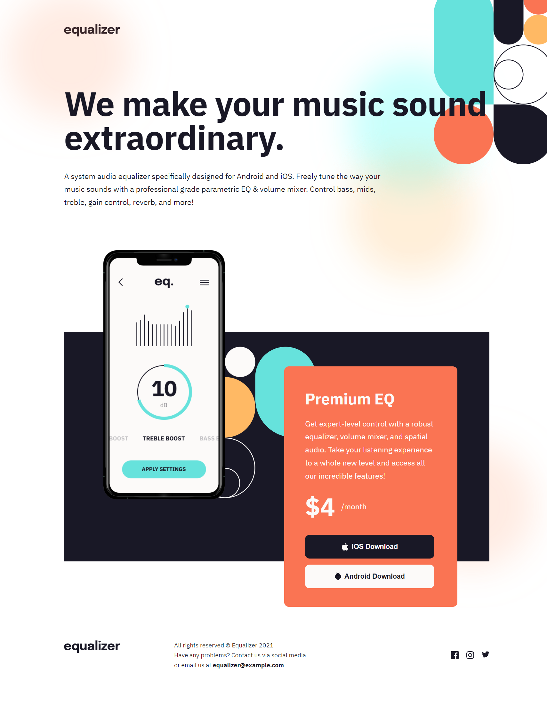
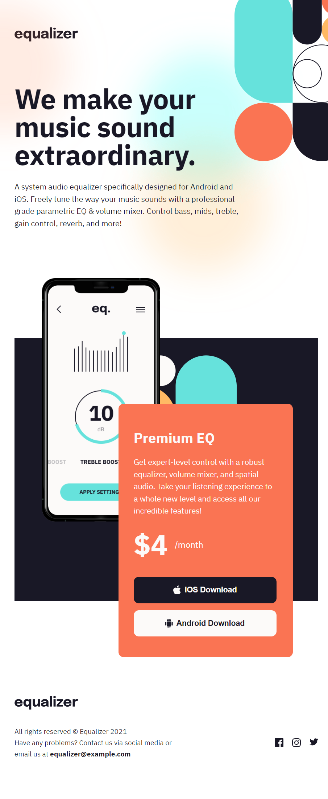
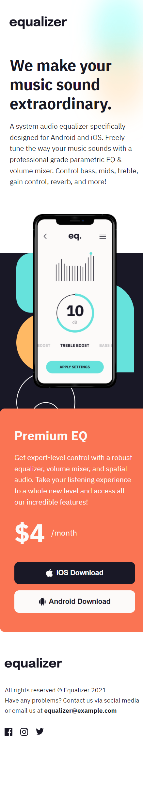

# Frontend Mentor - Equalizer landing page solution

This is a solution to the [Equalizer landing page challenge on Frontend Mentor](https://www.frontendmentor.io/challenges/equalizer-landing-page-7VJ4gp3DE). Frontend Mentor challenges help you improve your coding skills by building realistic projects. 

## Table of contents

- [Frontend Mentor - Equalizer landing page solution](#frontend-mentor---equalizer-landing-page-solution)
  - [Table of contents](#table-of-contents)
  - [Overview](#overview)
    - [The challenge](#the-challenge)
    - [Screenshot](#screenshot)
    - [Links](#links)
  - [My process](#my-process)
    - [Built with](#built-with)
    - [What I learned](#what-i-learned)

**Note: Delete this note and update the table of contents based on what sections you keep.**

## Overview

### The challenge

Users should be able to:

- View the optimal layout depending on their device's screen size
- See hover states for interactive elements

### Screenshot

### Links

- [Frontend Mentor Solution Page](https://www.frontendmentor.io/solutions/equalizer-responsive-landing-page-using-html-and-css-flex-and-grid-FRpEI0lt1m)
- [Github Pages Live Demo](https://jorgemunozcerda.github.io/fm-newbie-equalizer-landing-page/)

## My process

### Built with

- HTML5
- CSS
- Flexbox
- CSS Grid

### What I learned

I learned and got to practice how to add backgrounds and be able to also have them be responsive in a way that doesnt disrupt the flow of the main things on the page